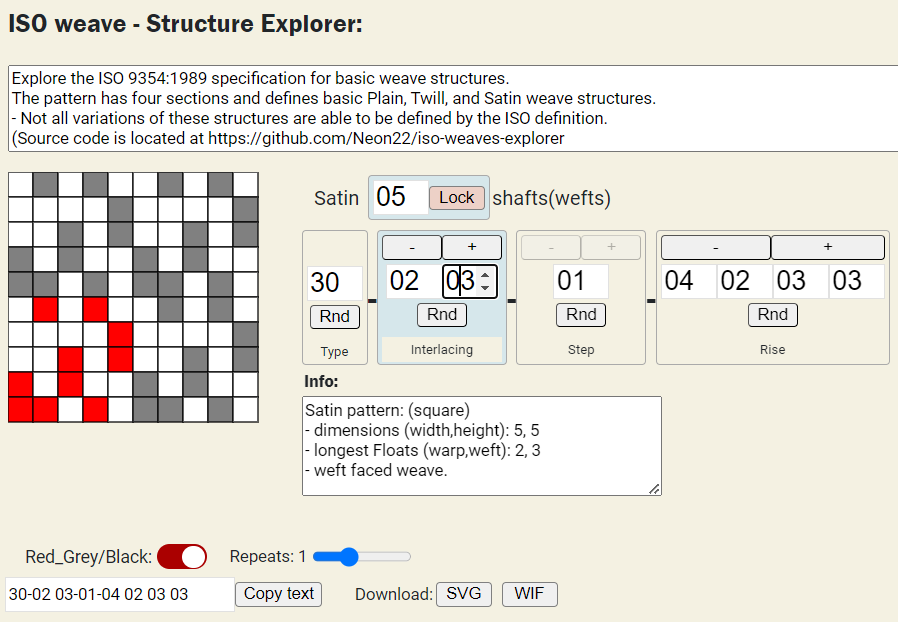

# iso-weaves-explorer
A web based explorer of the parameters in the ISO 9354:1989 specification for basic weave structures.
The ISO standard allows for Plain, Twill, and Satin basic weaves.
Not many weave structures are actually supported.

The Explrorer shows you what the numbers do and how the ISO format works.

wifs, and svg files may be downloaded, or you can copy and paste the iso name.

Runs in the Browser. Uses pyscript.

